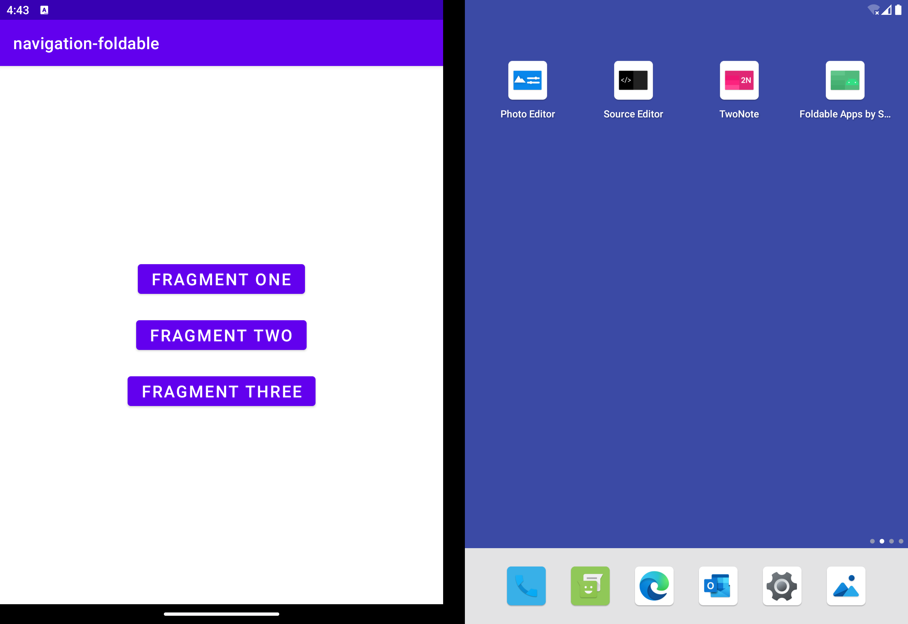
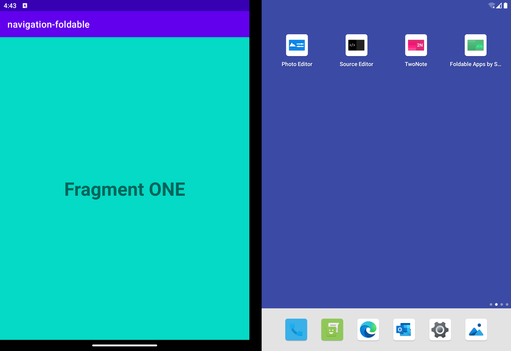
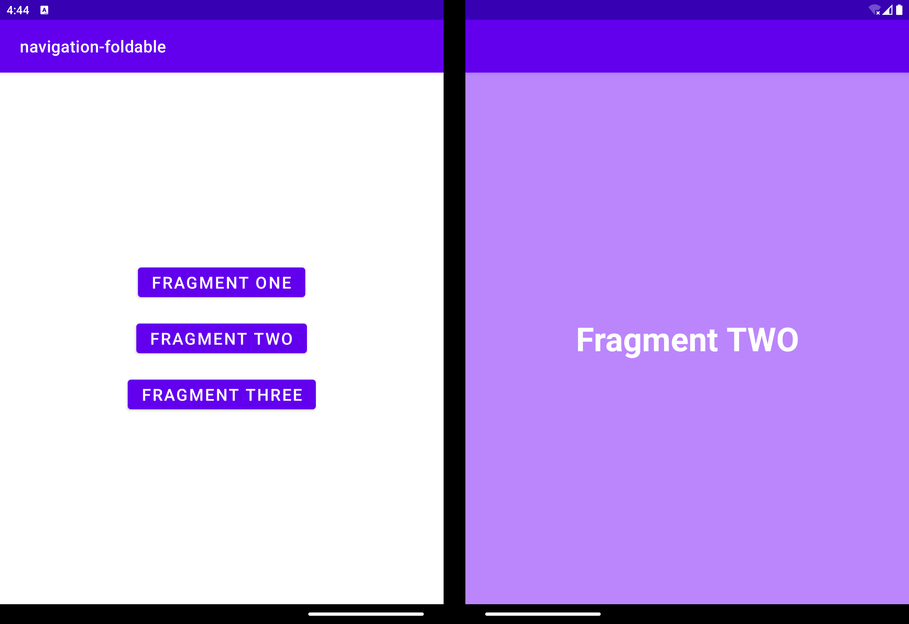
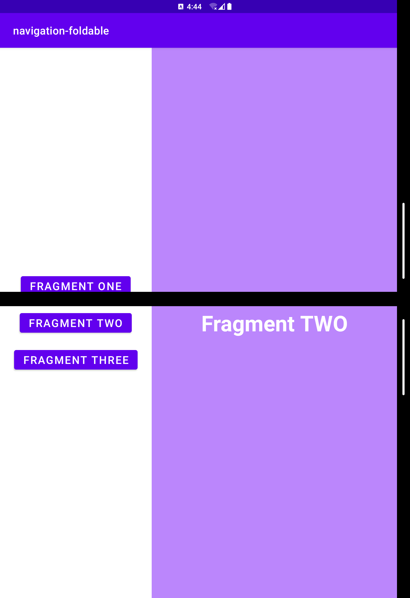
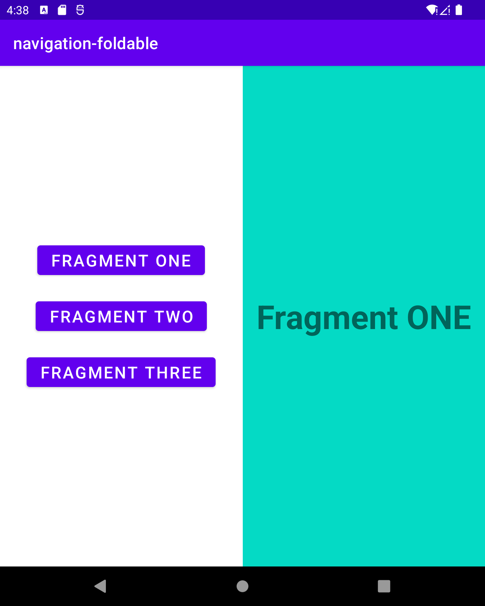
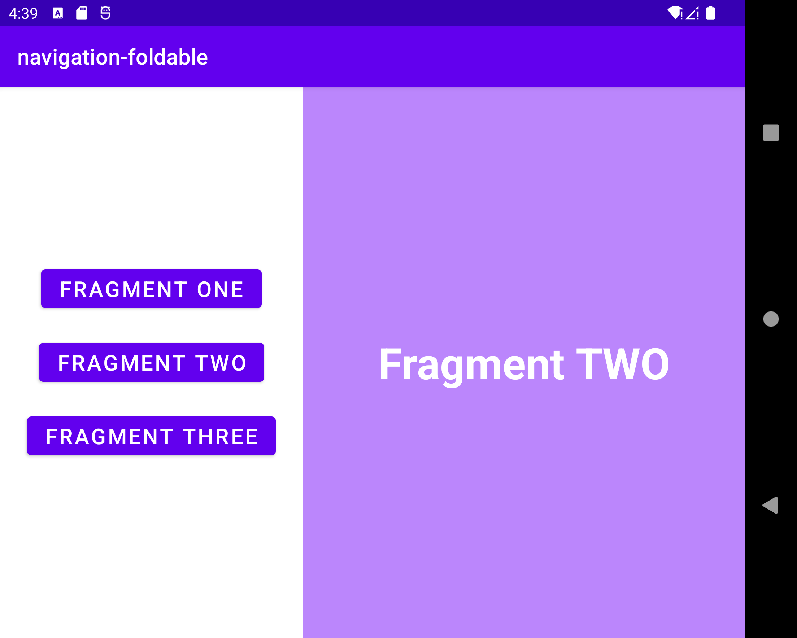
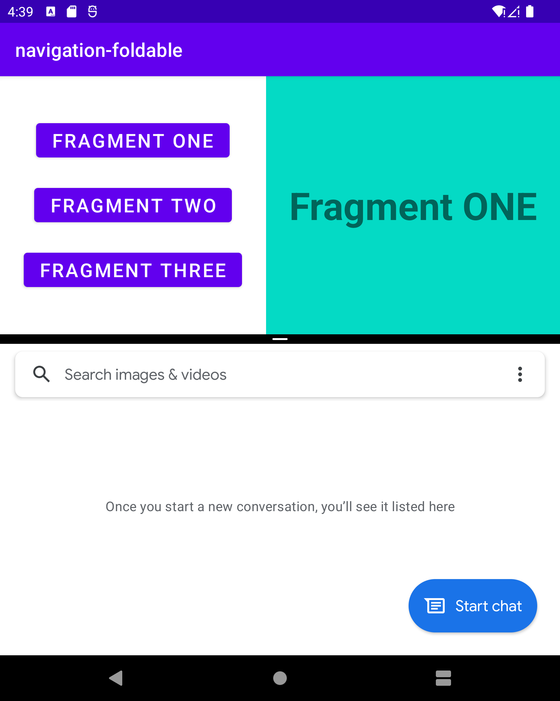
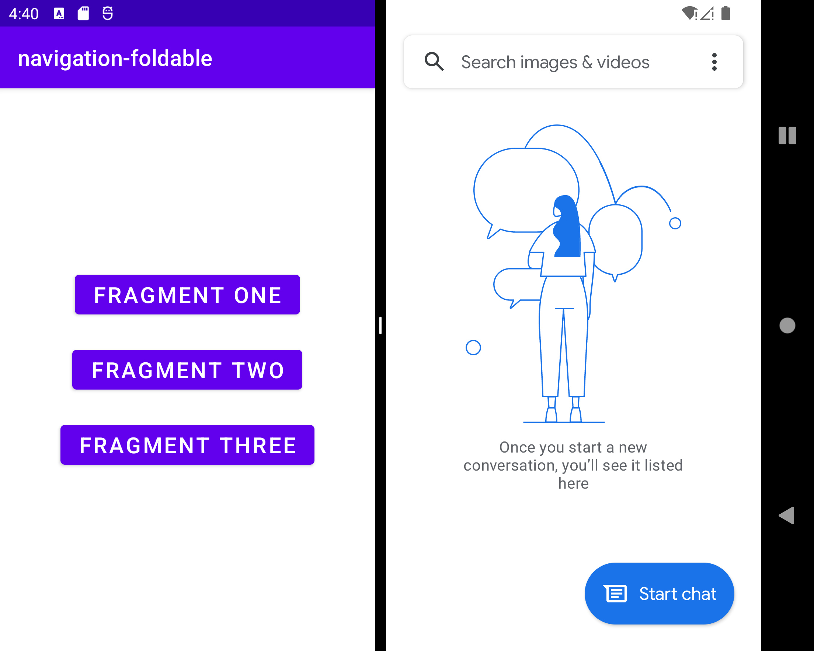
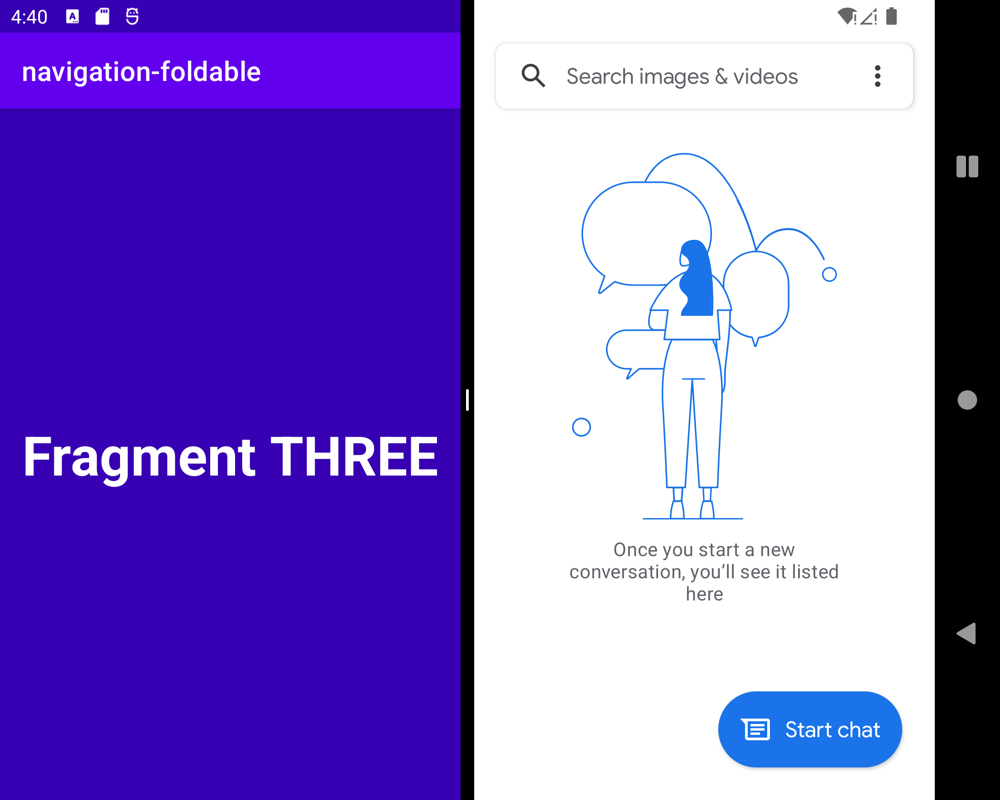

# Navigation-foldable sample

`androidx.navigation` component has been updated to support foldable, dual-screen and large-screen devices.
`SlidingPaneLayout` now is used under the hood in this component and enables `list-detail` capabilities.
This feature is useful when we want to create navigation paths where we go from A to B, following A and B a common list-detail navigation pattern.

This sample app uses the following components:

- [Navigation 2.4.0-rc01](https://developer.android.com/jetpack/androidx/releases/navigation#version_240_2)

For more information, `Navigation` component uses under the hood:

- [SlidingPaneLayout 1.2.0-rc01](https://developer.android.com/jetpack/androidx/releases/slidingpanelayout#version_120_2)

And `SlidingPaneLayout` uses:

- [Jetpack Window Manager 1.0.0-rc01](https://developer.android.com/jetpack/androidx/releases/window#1.0.0-rc01)

## How does it work?

On single screen mode on Surface Duo (or single screen devices or multi-window mode on other foldables), a list of
buttons is shown, when clicked on one, a right pane overlaps the list adding a new navigation step. 
When the app is spanned across displays on Surface Duo and other foldables or on large-screen devices, we will the navigation steps (A and B / list-detail) shown side by side.

### Examples

#### App running on a dual-screen device:

Surface Duo showing A-navigation-step/list pane on single screen mode

Surface Duo showing the B-navigation-step/detail pane on single screen mode

Surface Duo showing A and B navigation-steps/list-detail panes side by side on dual-screen (spanned) portrait mode

Surface Duo showing A and B navigation-steps/list-detail panes side by side on dual-screen (spanned) landscape mode

#### App running on a foldable device:

Foldable device showing A and B navigation-steps/list-detail panes side by side on portrait mode

Foldable device showing A and B navigation-steps/list-detail panes side by side on landscape mode

Foldable device showing A abd B navigation-steps/list-detail panes on multi-window on portrait mode

Foldable device showing A-navigation-step/list pane on multi-window on landscape mode

Foldable device showing B-navigation-step/detail pane on multi-window on landscape mode

## Code of Conduct

This project has adopted the [Microsoft Open Source Code of Conduct](https://opensource.microsoft.com/codeofconduct/). For more information see the [Code of Conduct FAQ](https://opensource.microsoft.com/codeofconduct/faq/) or contact [opencode@microsoft.com](mailto:opencode@microsoft.com) with any additional questions or comments.

## License

Copyright (c) Microsoft Corporation.

MIT License

Permission is hereby granted, free of charge, to any person obtaining a copy of this software and associated
documentation files (the "Software"), to deal in the Software without restriction, including without limitation the
rights to use, copy, modify, merge, publish, distribute, sublicense, and/or sell copies of the Software, and to
permit persons to whom the Software is furnished to do so, subject to the following conditions:

The above copyright notice and this permission notice shall be included in all copies or substantial portions of the
Software.

THE SOFTWARE IS PROVIDED AS IS, WITHOUT WARRANTY OF ANY KIND, EXPRESS OR IMPLIED, INCLUDING BUT NOT LIMITED TO THE
WARRANTIES OF MERCHANTABILITY, FITNESS FOR A PARTICULAR PURPOSE AND NONINFRINGEMENT. IN NO EVENT SHALL THE AUTHORS
OR COPYRIGHT HOLDERS BE LIABLE FOR ANY CLAIM, DAMAGES OR OTHER LIABILITY, WHETHER IN AN ACTION OF CONTRACT, TORT OR
OTHERWISE, ARISING FROM, OUT OF OR IN CONNECTION WITH THE SOFTWARE OR THE USE OR OTHER DEALINGS IN THE SOFTWARE.